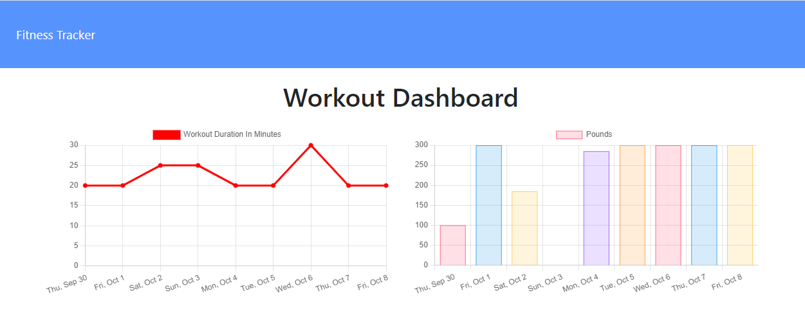

# Workout Tracker

This is a workout tracker application which helps a consumer to reach their fitness goals more quickly when they track their workout progress.

## User Story

```md
 As a user, 
 I want to be able to view create and track daily workouts. 
 I want to be able to log multiple exercises in a workout on a given day. 
 I should also be able to track the name, type, weight, sets, reps, and duration of exercise. 
 If the exercise is a cardio exercise, I should be able to track my distance traveled.
```

## Screenshot of the page

[Workout Tracker](https://workout-tracker-mvpie.herokuapp.com/?id=61614ba1ada1e6001707c93f) - deployed version



## What's included

Here is a created Mongo database with a Mongoose schema and handle routes with Express. The deployed application with a MongoDB database to Heroku, was set up a MongoDB Atlas account and connect a database from there to the application.

- Technologies/Frameworks/Resources/Packages:
  - express
  - mongoose 
  - nodemon
  - node
## Links to Review

* The URL of the functional, deployed application on Heroku: https://workout-tracker-mvpie.herokuapp.com
* The URL of the GitHub repository: https://github.com/MaryVPie/workout-tracker